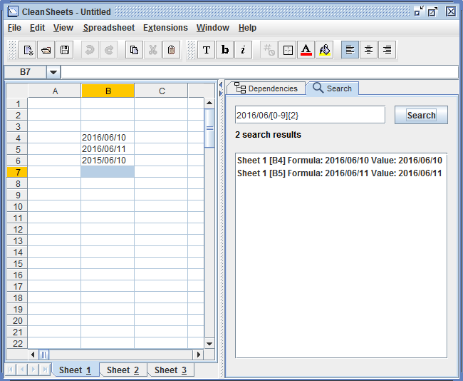
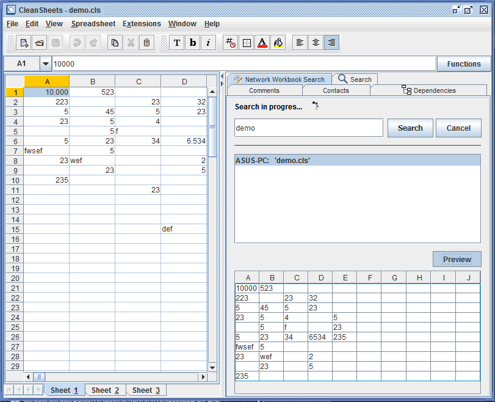

Cleansheets 2016
================
  
This readme file is written in [markdown](http://daringfireball.net/projects/markdown/). 

Startup Guide
-------------
 
This project uses maven. It should be possible to work with the project using any IDE (e.g., Netbeans, Eclipse, IntelliJ).

However, this project was essentially tested with the Netbeans IDE. Even if using an IDE some tasks should be executed from a console or terminal window, specially the execution of the application during demonstrations. These tasks are described at the bottom of this file.  

### First Step - Requirements

The first thing you need to do is to make sure you have all the requirements. Please read the section about requirements in this file.

### Second Step - Build and Run Cleansheets

Open the project with Netbeans. Right click the project and select "Clean and Build". Right click on the project and select "Run". Choose the class "csheets.CleanSheets". 

**Note About the Build:** 
- Cleansheets uses ANTLR grammars. The grammars are specified in ".g" files. The build process generates java code based on the grammars before compiling the java code. Grammars are located in the "src/main/antlr" folder. Generated code is produced to the "target" folder. 

### Third Step - Study the Project

The third step we propose is to study the code and documentation. In particular, you should study the extension mechanism of Cleansheets. 

You will find a very simple extension named "Simple Extension". This extension is documented in javadoc. You can start by this one since, as the name implies, it is very simple.

To generate the javadoc right click on the project and select "Generate Javadoc".

Open the javadoc documentation and read the documentation regarding the package "csheets.ext.simple". Note: To see the documentantion for a package click on the link for the package.

You should also take a look at the overview page of the javadoc.

**Note About the Javadoc:** As you can see, the javadoc also includes technical diagrams (i.e., UML). These diagrams ('png' files) are generated from textual specification that are located in '.puml' files. These files are processed by plantuml at the beginning of the javadoc process. The plantuml plugin of Netbeans is also able to dynamically generate a visual representation of a '.puml' file when the file is open.   

### Fourth Step - Study the Example Use Case 

You can find an example of the implementation of a use case in the package 'csheets.ext.comments'. The technical documentation of use cases should appear in sub-packages of 'chseets.userstories'. For the comments extension you find the technical documentation in the package 'chseets.userstories.core02_01.comments'.  

### Fifth Step - Execute the Unit Tests 

To execute the unit tests right click on the project and select "Test". Take a look at the unit tests.

You can also right click on the project and select "Code Coverage"/"Show Report...". This option will display the code coverage of unit tests (you need to execute a full "Build" or a "Clean and Build" to have this information). By clicking on a class, Netbeans will open the corresponding source file. This time the editor will display lines representing code that is covered by tests with a green background and lines representing code not covered by tests with a red background color.

Global Requirements
-------------------

### Graphviz
You should install [Graphviz](http://www.graphviz.org/) in your computer 
to be able to generate all type of uml diagrams with plantuml in javadoc.

### Plantuml
[Plantuml](http://www.plantuml.com) is a jar file that is already included in the project and that produces uml diagrams from a textual description.

Netbeans Requirements
---------------------

### Plantuml

This plugin adds support for realtime preview of plantuml diagrams. You should install it from the Plugins window of Netbeans.

### Markdown Support

This plugin adds support for markdown syntax on readme files (like this one). You should download the plugin from [Flow NetBeans Markdown](https://github.com/madflow/flow-netbeans-markdown) and install it.

### Display Readme Files in Project View

This is a very simple plugin that simple displays readme files in the project view. You should install it from the Plugins window of Netbeans.

### ANTLRWorks

You may install this netbeans plugin to have a smart editor for grammar files. This plugin is optional since the ANTLRWorks jar file that comes with the project does everything this plugin does and more.

**This plugin was only tested with Netbeans 8.0.1!**

### JaCoCo 

This plugin adds support for code coverage information (for instance test coverage information). The name of the plugin is "TikiOne JaCoCoverage". For further information see the web site of the projet ([jacoco](http://eclemma.org/jacoco/)).

Tasks Executed From the Terminal/Console
----------------------------------------

**VERY IMPORTANT: ALL THE WEEKLY DEMONSTRATIONS ARE REQUIRED TO BE EXECUTED WITHOUT NETBEANS (OR ANY IDE). The demonstrations are required to be executed from a terminal/console.** 

### Execute Cleansheets from the Terminal/Console

After a full build of Cleansheets, Netbeans will provide all required artifacts in a folder named 'target'. There you will find, for instance, the jar file that is the result of a successful build.

The mandatory process to build and execute the project in the demonstrations (in a unix like system) is to open a console (or terminal) and type:

    mvn clean package site
    java -jar ./target/csheets-1.0-SNAPSHOT-jar-with-dependencies.jar

This will create the jar of the application as well a generate a set of local web pages (see target/site) containing all the documentation of the project.

### Execute a Console to Tests Formulas

Cleansheets comes with a second "main" class that can be used to execute a console to interactively test formulas.

This class can be executed from Netbeans. Just right click on the project and select "Run". Then select the class 'csheets.core.formula.compiler.Console'.

### Execute ANTLRWorks

ANTLRWorks is already included in the project.

ANTLR v3 (and ANTLRWorks) are used in the formula parser and lexer. The antlr-3.5.2-complete.jar contains both APIs of 
ANTLR: v2 and v3. ANTLRWorks is contained in a jar file that is located in the lib folder (antlrworks-1.5.2-complete.jar). You can run this jar
to open the IDE for developing ANTLR v3 grammars. Using ANTLRWorks gives you the possibility to have a smart editor for your grammar and also to view 
a graphical parser tree of expressions (using the "interpreter"). 

To run ANTLRWorks execute in the terminal:
    
    cd tools
    java -jar antlrworks-1.5.2-complete.jar
 
### Netbeans Custom Options for Maven 

The repository comes with two custom options that can be used to execute specific maven goals. These options can be executed by right clicking on the project and select: 

#### cobertura

This will generate the test coverage report. This is also generated when you simple run the tests.

#### site

This will generate a site for the project that contains several documentation about the project. This documentation includes the javadoc report and the test coverage report. 

